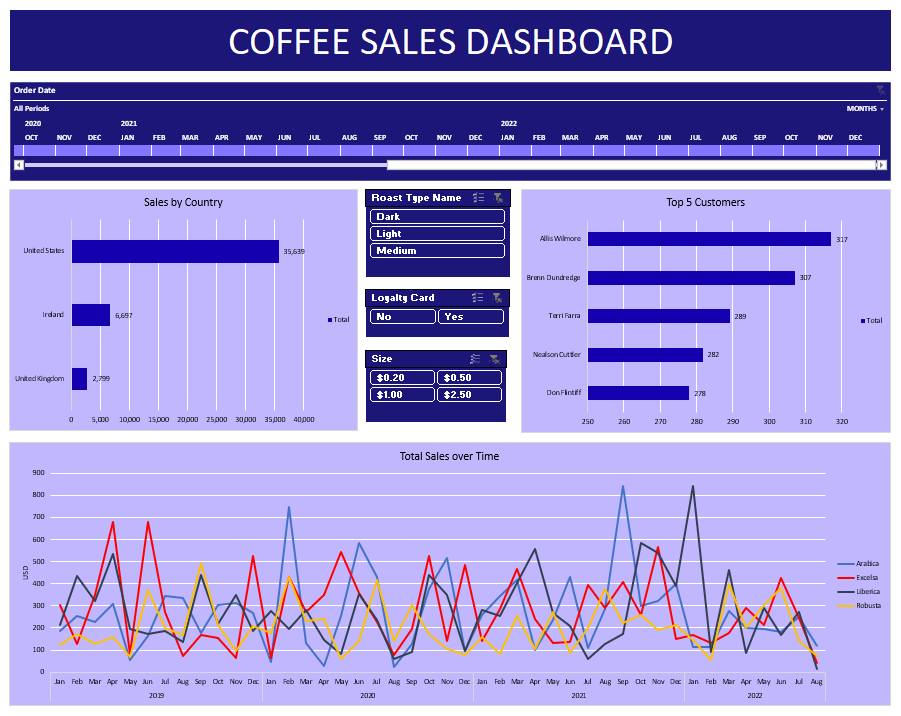

# Coffee Sales Analysis

This project provides a comprehensive analysis of coffee sales data, presented through various visualizations and summaries. The data has been compiled from orders placed by customers, and it includes information about customers, products, sales trends, and top customers. The project also contains an interactive dashboard for better insights.

## Data Overview:
The dataset used for this project comprises several sheets with detailed information on coffee orders, customer details, and product specifications. The data has been organized to facilitate analysis and visualization.

#### Sheets:
- orders: Contains individual order details, including order ID, customer ID, product ID, quantity, price, sales, and customer details.
- customers: Provides detailed information about customers such as name, email, phone, address, and loyalty card status.
- products: Lists available coffee products with their specifications, including coffee type, roast type, size, unit price, and profit margin.

## Dataset Details:

1. Orders Sheet
- Order ID: Unique identifier for each order.
- Order Date: The date the order was placed.
- Customer ID: Unique identifier for the customer.
- Product ID: Unique identifier for the product ordered.
- Quantity: Quantity of the product ordered.
- Sales: Total sales value of the order.
- Coffee Type: Type of coffee (e.g., Arabica, Robusta, etc.).
- Roast Type: Type of roast (e.g., Medium, Light, etc.).
- Loyalty Card: Indicates if the customer has a loyalty card.

3. Customers Sheet
- Customer Name: Name of the customer.
- Email: Email address of the customer.
- Country: Country where the customer is located.
- Phone: Contact phone number.
- Loyalty Card: Loyalty card status (Yes/No).

5. Products Sheet
- Coffee Type: Type of coffee product (Arabica, Robusta, etc.).
- Roast Type: The roast type of the coffee (Light, Medium).
- Size: The size of the coffee package.
- Unit Price: Price per unit.
- Profit: Profit per unit sold.

7. TotalSales Sheet
Contains a pivoted summary of sales data categorized by coffee type and year, including grand totals.

9. CountryBarChart Sheet
Total sales by country, allowing analysis of regional performance.

11. TopFiveCustomers Sheet
Contains the top five customers by total sales, showing their individual sales contributions.

13. Dashboard
Provides a high-level view of coffee sales trends, top customers, and other key performance metrics.

## Key Visualizations:

- Sales by Country: Bar chart summarizing total sales across different countries, enabling a comparison of sales performance by region.
- Top 5 Customers: Highlights the top-performing customers based on their purchases.
- Total Sales Summary: Aggregated total sales by year and coffee type, providing insights into the best-selling products and time periods.

## Dashboard:

The dashboard integrates key metrics and visualizations such as:

- Sales trends over time
- Product performance by coffee type and roast
- Top 5 customers and regional sales
- A breakdown of sales by country

This allows for easy navigation and understanding of the overall sales performance.

## Summary:

-	Made a dashboard in Excel to show the sales trend in different sub-categories, top 5 customers, and top 3 sales by country which are filtered by 4 attributes 
- Cleaned and Pre-processed 1,000 rows using Excel to prepare the data for analysis using XLOOKUP and Pivot Tables

